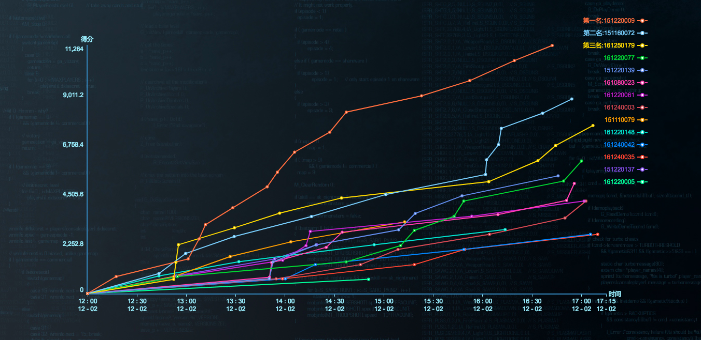
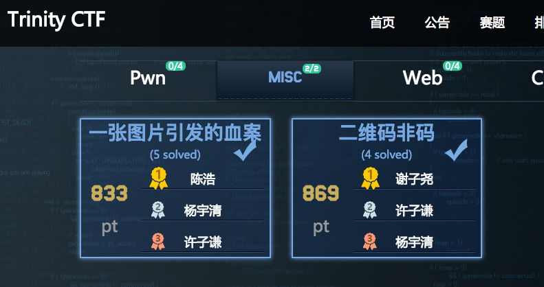
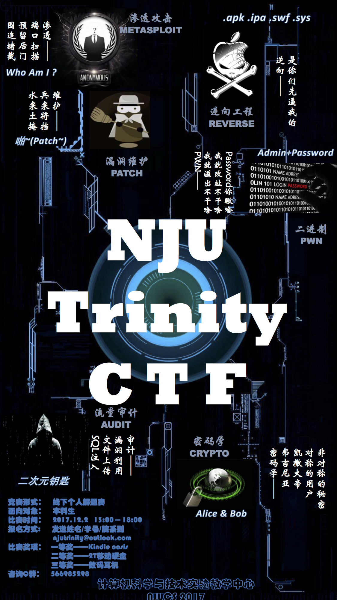

##Misc  
###隐写术  
  
`一张图片引发的血案`  
用winhex看到此jpg和正常jpg开头几位有一点不同，修改后是16 06 68 88，倒过来88 89 90 91，ASCII码是XYZ[，修改文件后缀为zip，"XYZ["即为解压密码

`二维码非码`  
使用stegsolve看到第二个图层时是正常二维码了（也可以用PS软件反转下黑白颜色吧），扫描得到一堆字符，在线base64转换得解  
  
***

##Crypto  
###密码学  
`有钱人的游戏`  
[RSA](http://www.freebuf.com/articles/rookie/154183.html)
已知p、q、e和密文 求明文  
rsa1.py需python3的gmpy2  
rsa2.py需python2的libnum中的n2s

`乾坤大挪移`  

	Ywnsnyd{Hqf33nh_Hwdu70_!x_Jfxd}

[在线凯撒](http://tools.matchzones.net/caesar_cipher)一下就看到了

***
2017.12.2 南京大学仙林校区实验楼乙126机房
***
不知还会在这条路上看到多少风景呢  
也许这是很多人理解的黑客吧  

隐写术方面还小有成就哈
