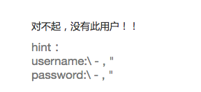
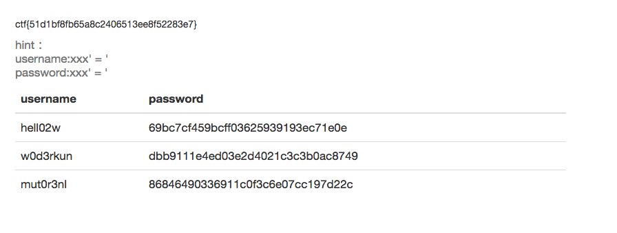

####登陆一下好吗??  
虽说过滤一切了，再试一试  

	\ - , or union # select * " /  

  
可知，引号没有被过滤，可以使用***万能密码***  
普通的select语句为：`select * from user where username = 'user' and password = 'passwd' `   
因为引号没有过滤，填入`xxx' = '` 甚至就 `'='`  
这是select语句就变为：`select * from user where username = 'xxx' = '' and password = 'xxx' = ''`   
其中username = 'xxx'（数据库中没有xxx项就会返回false，也就是0）变为 0 = ''，即0 = 0，为真(1)，password同理。
所以select语句就变为 `select * from user where 1 and 1`也就是 `select * from user`，查找user表中所有东西

***